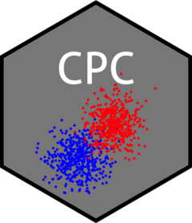

# CPC: Implementation of Cluster-Polarization Coefficient

<!-- badges: start -->
[](https://github.com/imehlhaff/CPC/actions/workflows/R-CMD-check.yaml)
[](https://CRAN.R-project.org/package=CPC)
[](https://cran.r-project.org/package=CPC)
[](https://lifecycle.r-lib.org/articles/stages.html#stable)
[](https://imehlhaff.net/CPC/LICENSE.html)
<!-- [](https://doi.org/10.5281/zenodo.290683) -->
<!-- [](https://app.codecov.io/gh/imehlhaff/CPC?branch=master) -->
<!-- badges: end -->

<a href="https://imehlhaff.net/CPC/"></a>

Implements cluster-polarization coefficient for measuring distributional polarization in single or multiple dimensions. Contains support for hierarchical clustering, k-means, partitioning around medoids, density-based spatial clustering with noise, and manually imposed cluster membership. Calculates CPC and adjusted CPC.

## Installation

There are two ways to easily install this package in R. To install the stable version released to CRAN, install as normal:

```
install.packages("CPC")
library(CPC)
```

To install the most recent development version, first ensure you have the latest version of ```devtools``` installed:

```
install.packages("devtools")
library(devtools)
```

Then, run the following code:

```
devtools::install_github("imehlhaff/CPC")
```

## Citation

To cite ```CPC``` in publications and working papers, please use:

Mehlhaff, Isaac D. "A Group-Based Approach to Measuring Polarization," American Political Science Review (forthcoming).

For BibTeX users:

```
@article{Mehlhaffforthcoming,
  title = {A {{Group-Based Approach}} to {{Measuring Polarization}}},
  author = {Mehlhaff, Isaac D.},
  year = {forthcoming},
  journaltitle = {American Political Science Review},
  url = {https://doi.org/10.1017/S0003055423001041}
}
```

## Usage

Most users of this package will be primarily interested in using it to easily calculate the CPC for a given distribution of numeric data. For example, let us take the bivariate, bimodal distribution generated by the following:

```
data <- matrix(c(rnorm(50, 0, 1), rnorm(50, 5, 1)), ncol = 2, byrow = TRUE)
```

### Algorithmic Cluster Assignment

Given our data generated above, the following call to ```CPC()``` uses k-means clustering to assign cluster membership to each observation, calculates the CPC, and returns a numeric vector of length 1:

```
CPC(data = data, k = 2, type = "kmeans")
```

Further arguments to fine-tune the specified clustering function, such as which particular algorithm to use, can be passed directly to ```CPC()```. For example, the following call specifies the MacQueen algorithm instead of the default Hartigan-Wong algorithm:

```
CPC(data = data, k = 2, type = "kmeans", algorithm = "MacQueen")
```

In particular, if ```type = "kmeans"```, the algorithm is only guaranteed to converge to local optima, so using a large number of random starts is recommended. This can be specified with the ```nstart``` argument to ```kmeans()```, again passed directly to ```CPC()```.

If we wanted to calculate the adjusted CPC instead, we need only add the optional ```adjust``` argument, which defaults to ```FALSE```:

```
CPC(data = data, k = 2, type = "kmeans", adjust = TRUE)
```

For more advanced users who wish to evaluate the output of the specified clustering function, the optional argument ```model``` can be set to ```TRUE```:

```
CPC(data = data, k = 2, type = "kmeans", model = TRUE)
```

In this case, ```CPC()``` returns a list containing the output of the specified clustering function, all sums of squares calculations, the CPC and the adjusted CPC. Because both the CPC and adjusted CPC are automatically calculated and returned as list elements, ```adjust``` need not be specified when ```model = TRUE```.

### Manual Cluster Assignment

In the case that pre-specifying cluster membership is theoretically justified or empirically desirable, the CPC can be calculated with user-imposed clusters. Cluster membership should be identified for each observation included in the calculation, and these identifications should be included in their own column in the matrix or data frame. To update our example data from above:

```
clusters <- matrix(c(rep(1, 25), rep(2, 25)), ncol = 1)
data <- cbind(data, clusters)
```

```CPC()``` can now be called, with ```type = "manual"``` and calls to the optional arguments ```cols``` and ```clusters``` denoting the columns containing data and cluster memberships, respectively:

```
CPC(data = data, type = "manual", cols = 1:2, clusters = 3)
```
